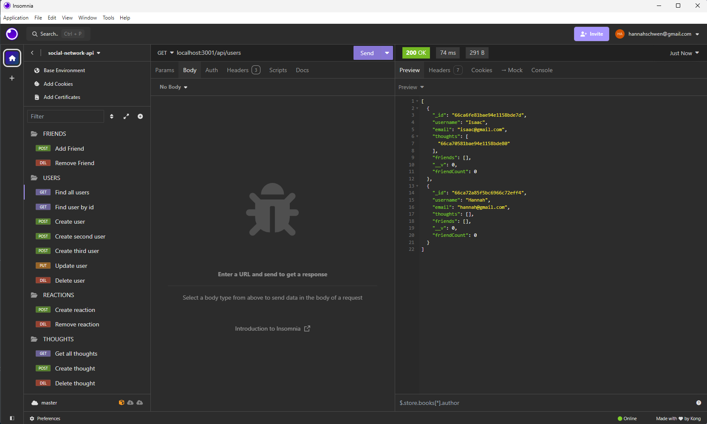

# Social Network API

## Description

API for a social network web application where users can share their thoughts, react to friends’ thoughts, and create a friend list. Uses Express.js for routing, a MongoDB database, and the Mongoose ODM

## Installation

To start the server, from the terminal, use command:

````
npm run start
````

## Usage

[This short video](https://drive.google.com/file/d/1jC90FB93rA5Bi8byEhXrquZSlunNwIO-/view?usp=drive_link) demonstrates the application's functionality (using Insomnia).

The following screenshot shows the application open in Insomnia:



This API can be used to:

- Find all users, find a single user by their id, create a user, update a user, or delete a user

- Add and remove friends

- Find, create, and delete thoughts

## API Routes:

Reference the following routes to use the API. Some functions require information from the request body (JSON).

### View all users:

GET request at /api/users

### View a single user:

GET request at /api/users/(USER's ID HERE)

### Create a user:

POST request at /api/users/(USER's ID HERE)

Example data for request body:
````
{
  "username": "User's username",
  "email": "user@email.com"
}
````

### Update a user:

PUT request at /api/users/(USER's ID HERE)

Example data for request body:
````
{
  "username": "Updated username",
  "email": "updated@email.com"
}
````

### Delete a user:

DELETE request at /api/users/(USER's ID HERE)


## License

[MIT license](./LICENSE)